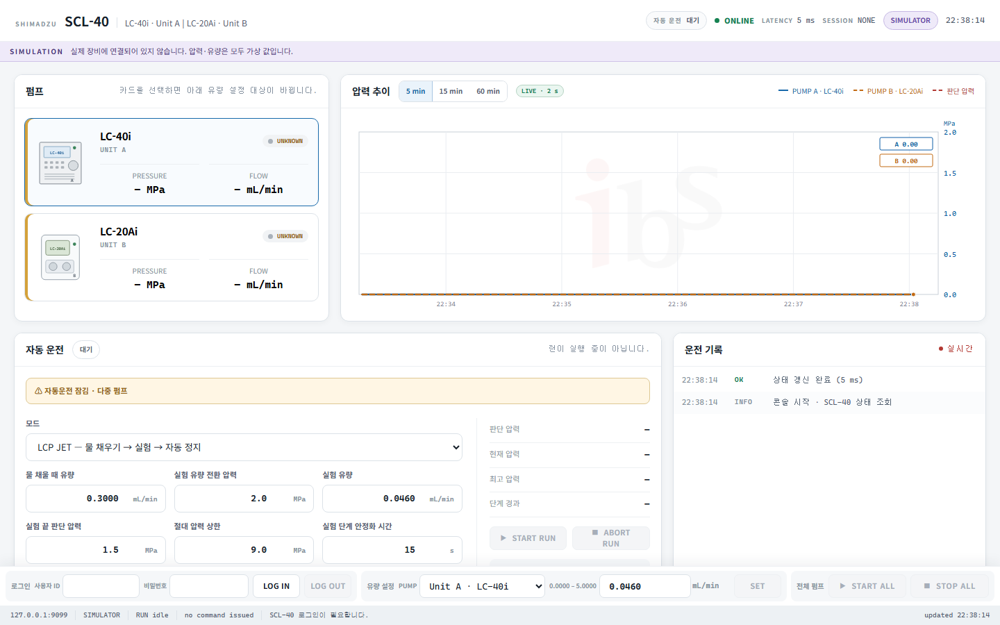

# SCL-40 Multi-Pump Control


A dependency-free Python dashboard for monitoring and controlling Shimadzu pumps
through an SCL-40 system controller over Ethernet. It provides a focused browser
interface for LC-40i and LC-20Ai pumps without requiring LabSolutions or Clarity.

> [!CAUTION]
> This is independent research software, not an official Shimadzu product and not
> validated for regulated use. Review the [safety notes](#safety-and-known-limitations)
> and verify every command on a safe, depressurized setup before experimental use.



The screenshot uses the built-in simulator. No physical instrument was connected.

## Install in three clicks

No Python installation or command line is required for the Windows release.

1. Open [GitHub Releases](https://github.com/daehyeon0311/scl40-control/releases/latest).
2. Download and extract `SCL40-Control-Windows-x64.zip`.
3. Double-click `SCL40-Control.exe`.

On the first launch, a small setup window asks for the SCL-40 IP address and whether
LAN access and control commands should be enabled. The choice is saved, the local
server starts, and the dashboard opens automatically in the default browser. Later
launches go directly to the dashboard. If it is already running, another double-click
simply opens the existing page.

Use `OPEN_SETTINGS.cmd` to reopen the first-run settings. Application data, logs, and
SQLite history are stored in:

```text
%LOCALAPPDATA%\SCL40-Control
```

> [!NOTE]
> The portable executable is built by the repository's public GitHub Actions workflow
> and is currently unsigned. Windows SmartScreen may show an unknown-publisher warning.
> The release includes `SHA256SUMS.txt` for integrity verification.

## Why this project exists

The target experiment uses an HPLC pump to push water behind an LCP jet cartridge
plunger. The operator needs to fill the line, detect the pressure transition that
indicates plunger movement, switch to the experiment flow, and stop safely at the
end of extrusion.

This project keeps those controls and the pressure history on one responsive page,
while placing method details, instrument information, alarms, and audit records in
a collapsible advanced section.

## Highlights

| Area | Capability |
|---|---|
| Discovery | Detect the SCL-40 and every pump returned by `Config.cgi` |
| Monitoring | Read per-unit model, flow, pressure, operation state, errors, and latency |
| Control | Set flow by UnitID with immediate Method 0 readback verification |
| System events | Confirmed system-wide `START ALL` and `STOP ALL` commands |
| Automation | Pressure-triggered LCP fill/run/stop workflow, timed operation, and live stage transitions |
| Multi-client | Several browsers share one serialized SCL control session |
| Safety | Pressure ceiling, stage timeouts, watchdog, command confirmation, and alarms |
| Records | SQLite telemetry, alarm history, CSV export, and tamper-evident audit chain |
| Development | Offline two-pump simulator with no physical instrument required |

## Validated topology

```text
Browser clients
      │  HTTP :8765
      ▼
Windows controller PC
      │  Ethernet / HTTP/XML
      ▼
Shimadzu SCL-40
      │  optical REMOTE link
      ├── Unit A · LC-40i
      └── Unit B · LC-20Ai
```

The current development system has been observed with:

| Component | Version / address |
|---|---|
| SCL-40 | Firmware 1.67 · `192.168.200.99` |
| LC-40i | Unit A · firmware 1.00 · optical address 3 |
| LC-20Ai | Unit B · firmware 1.01 · optical address 4 |
| Controller PC Ethernet | `192.168.200.101/24` |

Other firmware and module combinations must be validated independently.

## Run from source on Windows

### Requirements

- Windows 10 or 11
- Python 3 available as `py -3` or `python`
- Ethernet connectivity from the controller PC to the SCL-40
- The pump connected to the SCL-40 optical REMOTE chain

The application uses only the Python standard library. There is no package install
step and no `requirements.txt`.

### 1. Get the code

Download the repository ZIP or clone it:

```powershell
git clone https://github.com/daehyeon0311/scl40-control.git
cd scl40-control
```

### 2. Confirm the controller address

The supplied launcher targets `192.168.200.99`. If your SCL-40 uses another
address, edit the final line of `START_SCL40_GUI.cmd`.

Verify connectivity before enabling control:

```powershell
ping 192.168.200.99
py -3 .\scl40_probe.py 192.168.200.99
```

The probe performs read-only HTTP discovery and writes a timestamped log.

### 3. Start the dashboard

Double-click `START_SCL40_GUI.cmd`, then open:

```text
http://127.0.0.1:8765/
```

Log in with an account configured on the SCL-40. The common factory credential is
`Admin` / `Admin`, but installations may have changed it.

### Manual launch

```powershell
py -3 .\scl40_gui.py 192.168.200.99 `
  --enable-control `
  --bind 0.0.0.0 `
  --port 8765 `
  --no-browser
```

Omit `--enable-control` when starting a monitoring-only instance.

## 빠른 시작 요약

1. SCL-40 IP로 `ping`이 되는지 확인합니다.
2. `START_SCL40_GUI.cmd`의 IP가 실제 장비 주소와 같은지 확인합니다.
3. 파일을 더블클릭하고 `http://127.0.0.1:8765/`에 접속합니다.
4. SCL-40 계정으로 로그인합니다.
5. 처음에는 낮은 유량과 안전한 압력 상한으로 실제 동작을 확인합니다.

## LAN deployment

Binding to `0.0.0.0` allows other computers to reach the dashboard, but the Windows
firewall and network routing must also permit TCP port 8765.

1. Give the controller PC a stable LAN/Wi-Fi address.
2. Enable LAN access in the packaged app's first-run settings, or launch the source
   version with `--bind 0.0.0.0`.
3. If Windows Firewall asks, allow the application on **Private networks** only.
4. If your institution manages the firewall centrally, request an inbound TCP 8765
   rule restricted to the experiment subnet.
5. From another computer, open `http://<controller-pc-ip>:8765/`.

> [!IMPORTANT]
> The dashboard uses plain HTTP and is intended for a trusted private network or a
> VPN such as Tailscale. Do not forward port 8765 directly to the public internet.
> An SCL login and optional access PIN are not substitutes for TLS, network access
> control, or institutional security policy.

### Optional dashboard access PIN

Copy `scl40_access_pin.example.txt` to a private file such as
`scl40_access_pin.txt`, put one PIN in it, and launch with:

```powershell
py -3 .\scl40_gui.py 192.168.200.99 `
  --enable-control `
  --bind 0.0.0.0 `
  --access-pin-file .\scl40_access_pin.txt
```

The private PIN file is excluded by `.gitignore`.

## Accounts and roles

The SCL account still performs device authentication. The dashboard adds a local
authorization layer:

| Role | Dashboard access |
|---|---|
| `admin` | Flow, START/STOP, pressure limits, alarms, and records |
| `operator` | Flow, START/STOP, alarms, and records |
| `viewer` | Monitoring only |

`Admin` maps to `admin` by default, other authenticated SCL users map to
`operator`, and logged-out clients are view-only.

To override those defaults, create a private JSON file:

```json
{
  "Admin": "admin",
  "Operator1": "operator",
  "Guest": "viewer"
}
```

Launch with `--roles-file .\scl40_roles.json`. Do not commit account, role, or PIN
files containing site-specific information.

## Multi-pump behavior

Configuration, Method, and Monitor data are handled independently by UnitID. Flow
can therefore be read and written separately for Pump A and Pump B.

The confirmed `Event.cgi` START/STOP payload does **not** include UnitID. For that
reason the interface deliberately labels these operations `START ALL` and
`STOP ALL`. No independent per-pump motor start request is claimed or generated.

The automatic LCP run is disabled when more than one pump is connected. Enabling it
would require a physically confirmed per-pump start mechanism and defined pump roles.

## Automatic operation

| Mode / stage | Action | Transition |
|---|---|---|
| 물 채우는 중 | Apply fill flow and start | Pressure reaches `실험 유량 전환 압력` |
| 실험 중 | Apply experiment flow | Pressure reaches `실험 끝 판단 압력`, then STOP |
| 감시만 | Monitor an already started pump | End threshold is reached |
| 시간 운전 | Apply selected flow and start | Configured duration expires, then STOP |

For a single-pump LCP run, the fill stage watches pressure immediately. After the
flow transition, end-threshold monitoring is armed only after the settle time and
after pressure has first been observed below the end threshold. This prevents a
falling transient from being misread as the end of the experiment.

Protection priority, strongest first:

1. Instrument Method `Pmax` — handled by the pump without the PC.
2. Dashboard absolute pressure ceiling — aborts from any automatic stage.
3. Stage thresholds and stage timeouts.

The software watchdog does not replace an instrument-level `Pmax`.

## Offline simulator

Use the built-in simulator for UI development, demonstrations, and automated tests:

```powershell
py -3 .\scl40_gui.py --simulator --enable-control
```

Open `http://127.0.0.1:8765/` and log in with `Admin` / `Admin`. A purple
`SIMULATION` banner remains visible whenever no real instrument is connected.

To run the fake controller separately:

```powershell
py -3 .\scl40_sim.py --port 9099
py -3 .\scl40_gui.py 127.0.0.1:9099 --enable-control
```

The simulator reproduces confirmed response shapes and a simple pressure/flow model.
It cannot prove physical pump behavior or protocol compatibility.

## Data and audit records

Runtime history is stored in `scl40_history.sqlite3` beside the application. Its WAL
files, logs, credentials, and probe output are excluded from Git.

The dashboard can export:

- Per-pump pressure and flow telemetry
- Audit events and operator IP information
- Alarm history, including acknowledgements

Audit rows use a hash chain to make later modification detectable. This improves
traceability but is not a replacement for validated regulatory data systems,
electronic signatures, or LabSolutions data integrity controls.

## Command-line reference

| Option | Default | Purpose |
|---|---:|---|
| `host` | `192.168.200.99` | SCL-40 address or `host:port` |
| `--port` | `8765` | Local dashboard HTTP port |
| `--bind` | `127.0.0.1` | Dashboard listen address |
| `--enable-control` | off | Enable confirmed START/STOP endpoints |
| `--no-browser` | off | Do not open a browser automatically |
| `--pressure-ceiling` | `10.0` MPa | Highest Pmax the dashboard may write |
| `--guard-interval` | `1.0` s | Automatic-run pressure polling interval |
| `--history-db` | `scl40_history.sqlite3` | SQLite history location |
| `--roles-file` | none | SCL-user-to-role JSON mapping |
| `--access-pin-file` | none | Extra non-local API PIN |
| `--simulator` | off | Start against the built-in fake controller |

Run `py -3 .\scl40_gui.py --help` for simulator tuning options.

## Confirmed HTTP/XML surface

Only behavior observed on the current SCL-40 setup is treated as confirmed.
Older SCL-10AVP/LC-20 serial commands are not assumed compatible.

<details>
<summary>Show confirmed request shapes</summary>

Configuration and Method reads:

```xml
<Config/>
<Method><No>0</No></Method>
```

Monitor after login:

```text
POST /cgi-bin/Monitor.cgi/{SessionID}
```

```xml
<Monitor/>
```

System-wide pump event:

```xml
<Event><Method><PumpBT>1</PumpBT></Method></Event>
<Event><Method><PumpBT>0</PumpBT></Method></Event>
```

Selected-pump flow write, preserving the device-reported `Tflow`:

```xml
<Method><No>0</No><Pumps><Pump><UnitID>A</UnitID><Usual><Flow>0.1000</Flow><Tflow>1.0000</Tflow></Usual></Pump></Pumps></Method>
```

Pressure-limit write using fields and placement returned by Method 0:

```xml
<Method><No>0</No><Pumps><Pump><UnitID>A</UnitID><Usual><Flow>0.0460</Flow><Tflow>1.0000</Tflow><Pmax>8.0</Pmax></Usual><Detail><Pmin>0.0</Pmin></Detail></Pump></Pumps></Method>
```

Logout:

```xml
<Login><Mode>-1</Mode></Login>
```

Every write is followed by a Method 0 readback and field comparison. An ignored or
unexpected value raises an error instead of being reported as success.

</details>

## Safety and known limitations

- START/STOP is system-wide because the confirmed Event payload has no UnitID.
- Unit B flow writes and Pmax writes for both physical units completed with Method
  readback. Pmin still requires a deliberate first physical verification.
- A successful HTTP response or XML echo does not prove mechanical execution. Check
  Monitor readback and observe the physical pump.
- The SCL firmware permits one control login. Result code 13 usually means the SCL
  touch screen already owns the session; log out there before web login.
- LabSolutions must not simultaneously own the control session.
- Multiple dashboard clients share one SCL login. Commands are serialized, but
  operators must coordinate who has authority to act.
- The controller assets reference purge controls, but their complete request lifecycle
  has not been safely validated. Purge is intentionally not exposed.
- Do not add undocumented fields or automatically test new write commands on hardware.
- Restart recovery for an interrupted automatic run is intentionally not implemented.

## Tests

Run the offline suite. It uses only the standard library, needs no instrument, and
finishes in about two seconds:

```powershell
py -3 -m unittest discover
```

69 tests across three files:

| File | Covers |
|---|---|
| `test_scl40_multi.py` | Two-pump discovery, per-unit Method/Monitor handling, flow-write isolation, system events, timed operation, role policy, cache invalidation, history, alarms, CSV export, audit persistence |
| `test_scl40_protocol.py` | The real client against the simulator: XML builders and parsers, login result codes, write-then-readback verification, value limits, command serialization, trend history |
| `test_scl40_jetrun.py` | The LCP state machine, one tick at a time against a fake clock: fill/run transitions, arming rules, pressure ceiling, stage timeouts, aborts, watch mode |

The state machine tests replace `time.monotonic` with a controllable clock and call
`_tick()` directly, so every transition is deterministic and nothing waits on wall
time.

Write paths are exercised only against the simulator, never against hardware.

## Repository layout

| Path | Purpose |
|---|---|
| `scl40_gui.py` | HTTP server, session coordination, API, and CLI |
| `scl40_launcher.py` | First-run setup and packaged Windows launcher |
| `scl40_gui.html` / `.css` / `.js` | Responsive dashboard frontend |
| `scl40_jetrun.py` | Automatic LCP and timed-run state machine |
| `scl40_store.py` | SQLite telemetry, alarms, and audit storage |
| `scl40_probe.py` | Safe read-only SCL HTTP discovery |
| `scl40_sim.py` | Offline SCL-40 simulator |
| `test_scl40_multi.py` | Multi-pump, storage, and role regression tests |
| `test_scl40_protocol.py` | Client/simulator protocol and safety-limit tests |
| `test_scl40_jetrun.py` | LCP run state machine tests |
| `LICENSE` | MIT licence |
| `START_SCL40_GUI.cmd` | Windows launcher |
| `OPEN_SETTINGS.cmd` | Reopen packaged-app settings |
| `.github/workflows/windows-release.yml` | Tested Windows EXE and Release build |

## Contributing

Protocol changes should include captured read-only evidence or a clearly documented,
operator-approved physical test. Never infer LC-40 behavior from an older serial
protocol, and never commit credentials, session IDs, instrument logs, or site network
details. Use a GitHub issue or pull request to document reproducible evidence and
the exact firmware/module combination involved.

## License

MIT. See [LICENSE](LICENSE).

## Disclaimer

Shimadzu, LabSolutions, LC-40, LC-20, and SCL-40 are trademarks of their respective
owners. This repository is an independent interoperability project and is not
affiliated with or endorsed by Shimadzu Corporation.
